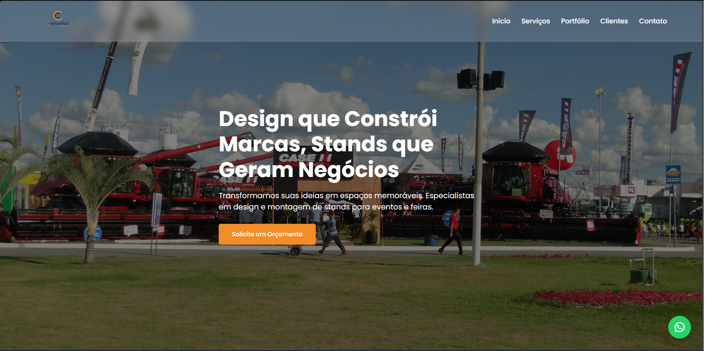
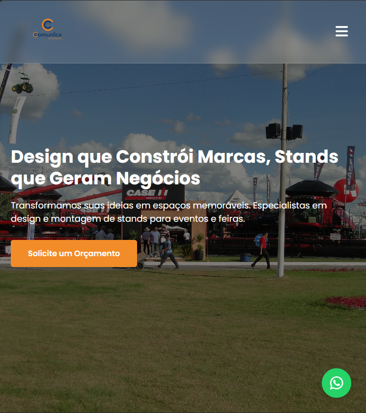
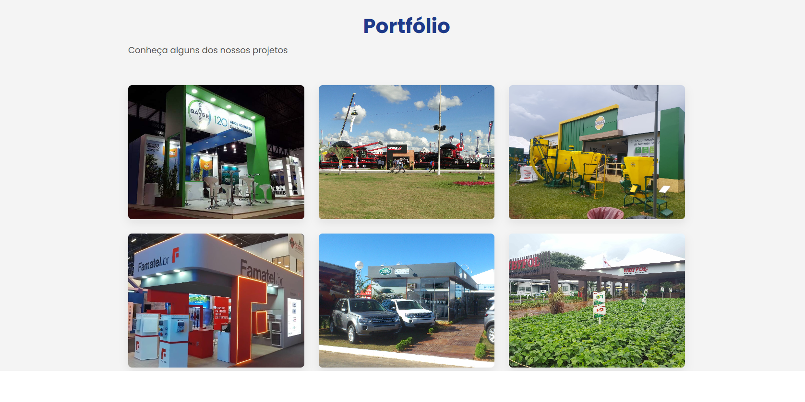

# 🎪 ComunicaStands - Site Institucional

> Site institucional desenvolvido para a ComunicaStands, empresa especializada em stands personalizados para eventos corporativos.

[](https://www.comunicastands.com.br)
[]()

---

## 📋 Sobre o Projeto

A **ComunicaStands** é uma empresa consolidada no mercado de eventos, especializada na criação de stands personalizados para feiras, congressos e eventos corporativos. Este projeto consistiu no desenvolvimento completo do site institucional da empresa, desde o design até o deploy em produção.

### 🎯 Objetivos do Projeto:
- Criar uma presença online profissional para a empresa
- Apresentar o portfólio de projetos de forma impactante
- Implementar sistema de captação de leads
- Garantir responsividade e performance

---

## 🚀 Tecnologias Utilizadas

### Frontend:
- **HTML5** - Estrutura semântica
- **CSS3** - Estilização e animações
- **JavaScript** - Interatividade e funcionalidades dinâmicas

### Integrações:
- **Formspree** - Captação de leads via formulário de contato
- **Google Workspace** - E-mail profissional (@comunicastands.com.br)

### Deploy e Infraestrutura:
- **Netlify** - Hospedagem e deploy contínuo
- **Registro.br** - Gerenciamento de domínio e DNS

---

## ✨ Funcionalidades

- ✅ Design responsivo (mobile-first)
- ✅ Galeria de portfólio com projetos da empresa
- ✅ Formulário de contato integrado
- ✅ Seção "Sobre Nós" com história da empresa
- ✅ Integração com WhatsApp para atendimento direto
- ✅ Performance otimizada (carregamento rápido)
- ✅ SEO básico implementado

---

## 🌐 Demo

**Acesse o site:** [www.comunicastands.com.br](https://www.comunicastands.com.br)

---

## 📸 Screenshots








---

## 🛠️ Desafios Técnicos Superados

### 1. Sistema de Captação de Leads
**Desafio:** Implementar formulário de contato sem backend próprio  
**Solução:** Integração com Formspree (serviço serverless)

### 2. E-mail Profissional
**Desafio:** Configurar e-mail corporativo  
**Solução:** Google Workspace + configuração de DNS

### 3. Deploy e DNS
**Desafio:** Conectar domínio personalizado ao Netlify  
**Solução:** Configuração de registros DNS no Registro.br

### 4. Responsividade
**Desafio:** Garantir boa experiência em todos os dispositivos  
**Solução:** CSS Grid + Flexbox + Media Queries

---

## 📂 Estrutura do Projeto

```
comunicastands/
│
├── index.html              # Página principal
├── style.css               # Estilos globais
├── script.js               # Funcionalidades JavaScript
│
├── images/                 # Imagens do site
│   ├── portfolio/          # Imagens do portfólio
│   ├── clientes/           # Logos de clientes
│   └── logo.png            # Logo da empresa
│
└── README.md               # Este arquivo
```

---

## 🎓 Aprendizados

Este projeto me ensinou:

- **Desenvolvimento Full-Cycle:** Da concepção à produção
- **Integração de Serviços:** Formspree, Google Workspace
- **Deploy e Infraestrutura:** Netlify, DNS, domínios
- **Comunicação com Cliente:** Levantamento de requisitos
- **Gestão de Projeto:** Planejamento, execução e entrega

---

## 👨‍💻 Autor

**Alisson Barreto**

- LinkedIn: [linkedin.com/in/alisson-barreto-6b0090257](https://www.linkedin.com/in/alisson-barreto-6b0090257/)
- GitHub: [github.com/SEU-USUARIO](https://github.com/SEU-USUARIO)
- E-mail: alissonjbsoares@hotmail.com

---

## 📝 Licença

Este projeto foi desenvolvido para uso exclusivo da empresa ComunicaStands.

---

## 🙏 Agradecimentos

Agradeço à equipe da ComunicaStands pela confiança e pela oportunidade de desenvolver este projeto.

---

⭐ **Se você gostou deste projeto, deixe uma estrela!**
